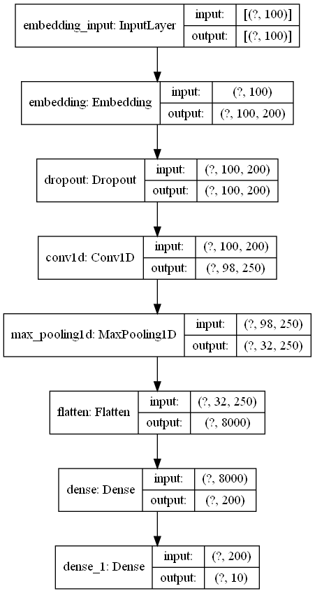

# SoftwareCup2021

## 数据集

- [搜狐网新闻](http://www.sogou.com/labs/resource/cs.php)，经预处理得可用七个，通过补充数据集和预处理获取共十个分类
- Counter({'其他': 209132, '科技': 199871, '汽车': 138576, '体育': 52411, '娱乐': 50138, '财经': 27489, '房产': 18815, '教育': 13012, '军事': 3294,'游戏':1300})


## 预处理

- 原始数据集数据格式为：（这里下载解压后是dat文件）

```xml
<doc>

<url>页面URL</url>

<docno>页面ID</docno>

<contenttitle>页面标题</contenttitle>

<content>页面内容</content>

</doc>
```

- preprocessing文件夹中有两个预处理程序，依次运行后将上面数据转换为并保存为new_dataset_jieba.pkl文件（放在仓库了，由于预处理耗时建议直接对此文件预处理或者直接用）

| contenttitle       | content        | label | contenttitle_cut      |
| ------------------ | -------------- | ----- | --------------------- |
| 中国渔民发现食人鱼 | 本台 记者 报道 | 其他  | 中国 渔民 发现 食人鱼 |

- 后缀带mul为多进程版本（TODO）

## CNN

- 使用卷积模型



参数很多能训练一个小时，

- 使用预训练的word2vec作为词嵌入层，能加快训练速度和提高泛化能力

